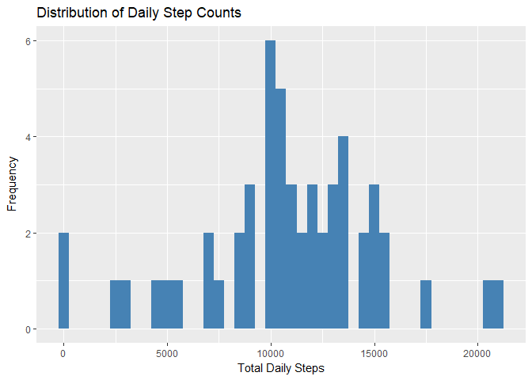
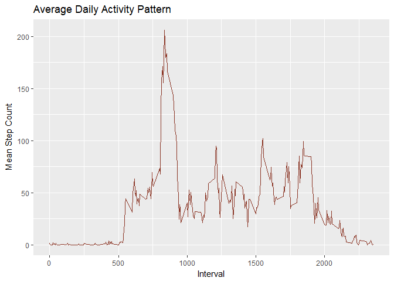
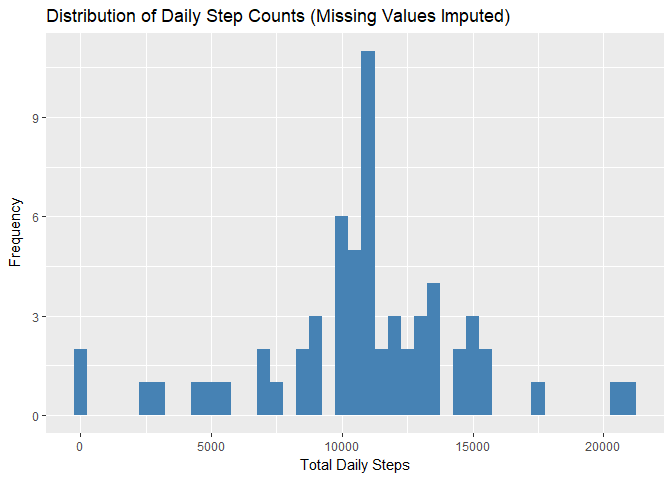
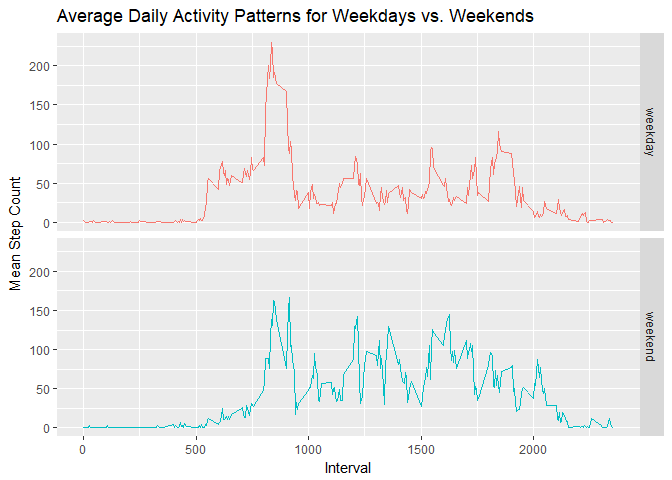

## Loading and preprocessing the data

Firstly, the csv-formatted data is loaded from the zip archive containing it, 
and the 'date' variable is converted from character into Date format to allow 
for more convenient analysis.


```r
data <- read.csv(unz("activity.zip", "activity.csv"))
data$date <- as.Date(data$date, "%Y-%m-%d")
```


## What is mean total number of steps taken per day?

The first step here is to calculate the total step count for each day. Then,
before caculating any summary statistics, a histogram is plotted to give a
visual overview of the distribution of daily step counts.


```r
daily_steps <- aggregate(steps ~ date, data, sum)

library(ggplot2)
ggplot(daily_steps, aes(x = steps)) + 
    geom_histogram(fill = "steelblue", binwidth = 500) +
    xlab("Total Daily Steps") +
    ylab(expression("Frequency")) +
    ggtitle("Distribution of Daily Step Counts")
```

<!-- -->

Next, the mean and median daily step counts are calculated.

```r
mean_steps <- round(mean(daily_steps$steps, na.rm = T), digits = 2)
median_steps <- round(median(daily_steps$steps, na.rm = T), digits = 2)
print(paste("Mean:", mean_steps))
```

```
## [1] "Mean: 10766.19"
```

```r
print(paste("Median:", median_steps))
```

```
## [1] "Median: 10765"
```

So the mean daily step count is 10766.19, while the median is 
10765.

## What is the average daily activity pattern?

To answer this question, the mean step count for each interval is calculated, 
and a time series plot of these values is created to give a visual 
representation of the average activity levels over the day.


```r
interval_mn_steps <- aggregate(steps ~ interval, data, mean)

ggplot(interval_mn_steps, aes(interval, steps)) +
    geom_line(color = "tomato4") +
    xlab("Interval") +
    ylab("Mean Step Count") +
    ggtitle("Average Daily Activity Pattern")
```

<!-- -->

Next, the interval with the highest mean step count is calculated.


```r
library(dplyr)
max_steps_interval <- interval_mn_steps %>% 
    filter(steps == max(steps)) %>% 
    .$interval
print(paste("Interval w/ highest mean steps:", max_steps_interval))
```

```
## [1] "Interval w/ highest mean steps: 835"
```

So the interval with the greatest step count on average is 
835.

## Imputing missing values

The above calculations ignore any missing values in the dataset. This may
introduce some bias into the calculations, so, for comparison, these missing
values will now be imputed.  

First, the total number of missing step count values is calculated.


```r
total_missing <- sum(is.na(data$steps))
print(paste("Missing step counts:", total_missing))
```

```
## [1] "Missing step counts: 2304"
```

There are 2304 missing step count values. These will now be
imputed by replacing them with the mean step count value for the corresponding 
interval, in a copy of the original dataset.


```r
data_imputed <- data
missing <- which(is.na(data_imputed$steps))
for(i in missing) {
    interval_id <- data_imputed$interval[i]
    interval_mean <- interval_mn_steps %>%
        filter(interval == interval_id) %>%
        .$steps
    data_imputed$steps[i] <- interval_mean
}
```

As previously, the daily step counts are calculated and the distribution of
these plotted as a histogram. However, any missing values have now been imputed.


```r
daily_steps_imputed <- aggregate(steps ~ date, data_imputed, sum)

ggplot(daily_steps_imputed, aes(x = steps)) + 
    geom_histogram(fill = "steelblue", binwidth = 500) +
    xlab("Total Daily Steps") +
    ylab(expression("Frequency")) +
    ggtitle("Distribution of Daily Step Counts (Missing Values Imputed)")
```

<!-- -->

Next, the mean and median daily step counts are recalculated using this dataset.


```r
mean_steps_imputed <- round(mean(daily_steps_imputed$steps), digits = 2)
median_steps_imputed <- round(median(daily_steps_imputed$steps), digits = 2)
print(paste("Mean:", mean_steps_imputed))
```

```
## [1] "Mean: 10766.19"
```

```r
print(paste("Median:", median_steps_imputed))
```

```
## [1] "Median: 10766.19"
```

The mean step count is now 10766.19, and the median is 
10766.19. Only the median has changed, and is now 
equal to the mean.

## Are there differences in activity patterns between weekdays and weekends?

Finally, the average daily activity patterns for weekdays and weekends wil be
compared visually using a time-series plot.  

First, a new variable is added to the imputed dataset which indicates whether
the corresponding date is a weekday or a weekend.


```r
is_weekend <- function(date) {
    if(weekdays(date) %in% c("Saturday", "Sunday")) {
        return("weekend")
    }
    return("weekday")
}

data_imputed$weekday <- as.factor(sapply(data_imputed$date, is_weekend))
```

After caclculating the mean step count by interval and type of day, a 2-panel 
time-series plot is created to visually represent the difference in mean steps
per interval based on whether it is a weekday or weekend.


```r
steps_weekday <- aggregate(steps ~ interval + weekday, data_imputed, mean)

ggplot(steps_weekday, aes(interval, steps, color = weekday)) + 
    geom_line(show.legend = F) + 
    facet_grid(weekday ~ .) +
    xlab("Interval") +
    ylab("Mean Step Count") +
    ggtitle("Average Daily Activity Patterns for Weekdays vs. Weekends")
```

<!-- -->
