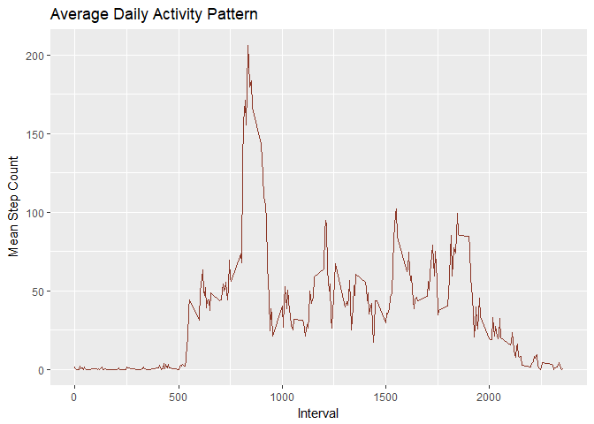

## Loading and preprocessing the data

First, we load the csv-formatted data from the provided zip file, and convert
the date variable from a character string to an R Date object.


```r
data <- read.csv(unz("activity.zip", "activity.csv"))
data$date <- as.Date(data$date, "%Y-%m-%d")
```


## What is mean total number of steps taken per day?

Before calculating the mean daily steps, we plot a histogram of the daily step
counts to visualise the data.


```r
library(ggplot2)
steps_by_day <- aggregate(steps ~ date, data, sum)
ggplot(steps_by_day, aes(x = steps)) + 
    geom_histogram(fill = "steelblue", binwidth = 500) +
    xlab("Steps") +
    ylab(expression("Frequency")) +
    ggtitle("Total Steps Per Day")
```

<!-- -->

Now we calculate the mean and median daily step counts.

```r
mean_steps <- round(mean(steps_by_day$steps, na.rm = T), digits = 2)
median_steps <- round(median(steps_by_day$steps, na.rm = T), digits = 2)
print(paste("Mean Daily steps:", mean_steps))
```

```
## [1] "Mean Daily steps: 10766.19"
```

```r
print(paste("Median Daily steps:", median_steps))
```

```
## [1] "Median Daily steps: 10765"
```

## What is the average daily activity pattern?


```r
interval_step_means <- aggregate(steps ~ interval, data, mean)
ggplot(interval_step_means, aes(interval, steps)) +
    geom_line(color = "tomato4") +
    xlab("Interval") +
    ylab("Mean Step Count") +
    ggtitle("Mean Step Count Over the Day")
```

<!-- -->


```r
library(dplyr)
max_steps_interval <- interval_step_means %>% 
    filter(steps == max(steps)) %>% 
    .$interval
print(paste("Interval with the most steps on average:", max_steps_interval))
```

```
## [1] "Interval with the most steps on average: 835"
```


## Imputing missing values


```r
total_missing <- sum(is.na(data$steps))
print(paste("Rows with missing values:", total_missing))
```

```
## [1] "Rows with missing values: 2304"
```


```r
data_imputed <- data
missing <- which(is.na(data$steps))
for(i in missing) {
    interval_id <- data_imputed$interval[i]
    interval_mean <- interval_step_means %>%
        filter(interval == interval_id) %>%
        .$steps
    data_imputed$steps[i] <- interval_mean
}
```


```r
steps_by_day_imputed <- aggregate(steps ~ date, data_imputed, sum)
ggplot(steps_by_day_imputed, aes(x = steps)) + 
    geom_histogram(fill = "steelblue", binwidth = 500) +
    xlab("Steps") +
    ylab(expression("Frequency")) +
    ggtitle("Total steps per day (missing values imputed)")
```

<!-- -->


```r
mean_steps <- round(mean(steps_by_day_imputed$steps, na.rm = T), digits = 2)
median_steps <- round(median(steps_by_day_imputed$steps, na.rm = T), digits = 2)
print(paste("Mean Daily steps:", mean_steps))
```

```
## [1] "Mean Daily steps: 10766.19"
```

```r
print(paste("Median Daily steps:", median_steps))
```

```
## [1] "Median Daily steps: 10766.19"
```

## Are there differences in activity patterns between weekdays and weekends?


```r
is_weekend <- function(date) {
    if(weekdays(date) %in% c("Saturday", "Sunday")) {
        return("weekend")
    }
    return("weekday")
}
data_imputed$weekday <- as.factor(sapply(data_imputed$date, is_weekend))
ggplot(data_imputed, aes(interval, steps)) + 
    geom_line(color = "seagreen4") + 
    facet_grid(weekday ~ .) +
    xlab("Interval") +
    ylab("Steps") +
    ggtitle("Steps per interval by part of week")
```

<!-- -->
